# Space Titanic: Analysis & Modeling
Trevor Preston

## Background

The Spaceship Titanic was an interstellar passenger liner launched a month ago. With almost 13,000 passengers on board, the vessel set out on its maiden voyage transporting emigrants from our solar system to three newly habitable exoplanets orbiting nearby stars.
<br>
<br>
While rounding Alpha Centauri en route to its first destination—the torrid 55 Cancri E—the unwary Spaceship Titanic collided with a spacetime anomaly hidden within a dust cloud. Sadly, it met a similar fate as its namesake from 1000 years before. Though the ship stayed intact, almost half of the passengers were transported to an alternate dimension!
<br>
<br>
To help rescue crews and retrieve the lost passengers, we are challenged to predict which passengers were transported by the anomaly using records recovered from the spaceship’s damaged computer system.


```python
# Packages

# Basics
import numpy as np
import pandas as pd
import math

# Visual
import matplotlib.pyplot as plt
import seaborn as sns
```


```python
# Load data

df = pd.read_csv('train.csv')
```

## Data Check


```python
df.shape
```


    (8693, 14)


```python
df.head()
```


<div>
<style scoped>
    .dataframe tbody tr th:only-of-type {
        vertical-align: middle;
    }

    .dataframe tbody tr th {
        vertical-align: top;
    }

    .dataframe thead th {
        text-align: right;
    }
</style>
<table border="1" class="dataframe">
  <thead>
    <tr style="text-align: right;">
      <th></th>
      <th>PassengerId</th>
      <th>HomePlanet</th>
      <th>CryoSleep</th>
      <th>Cabin</th>
      <th>Destination</th>
      <th>Age</th>
      <th>VIP</th>
      <th>RoomService</th>
      <th>FoodCourt</th>
      <th>ShoppingMall</th>
      <th>Spa</th>
      <th>VRDeck</th>
      <th>Name</th>
      <th>Transported</th>
    </tr>
  </thead>
  <tbody>
    <tr>
      <th>0</th>
      <td>0001_01</td>
      <td>Europa</td>
      <td>False</td>
      <td>B/0/P</td>
      <td>TRAPPIST-1e</td>
      <td>39.0</td>
      <td>False</td>
      <td>0.0</td>
      <td>0.0</td>
      <td>0.0</td>
      <td>0.0</td>
      <td>0.0</td>
      <td>Maham Ofracculy</td>
      <td>False</td>
    </tr>
    <tr>
      <th>1</th>
      <td>0002_01</td>
      <td>Earth</td>
      <td>False</td>
      <td>F/0/S</td>
      <td>TRAPPIST-1e</td>
      <td>24.0</td>
      <td>False</td>
      <td>109.0</td>
      <td>9.0</td>
      <td>25.0</td>
      <td>549.0</td>
      <td>44.0</td>
      <td>Juanna Vines</td>
      <td>True</td>
    </tr>
    <tr>
      <th>2</th>
      <td>0003_01</td>
      <td>Europa</td>
      <td>False</td>
      <td>A/0/S</td>
      <td>TRAPPIST-1e</td>
      <td>58.0</td>
      <td>True</td>
      <td>43.0</td>
      <td>3576.0</td>
      <td>0.0</td>
      <td>6715.0</td>
      <td>49.0</td>
      <td>Altark Susent</td>
      <td>False</td>
    </tr>
    <tr>
      <th>3</th>
      <td>0003_02</td>
      <td>Europa</td>
      <td>False</td>
      <td>A/0/S</td>
      <td>TRAPPIST-1e</td>
      <td>33.0</td>
      <td>False</td>
      <td>0.0</td>
      <td>1283.0</td>
      <td>371.0</td>
      <td>3329.0</td>
      <td>193.0</td>
      <td>Solam Susent</td>
      <td>False</td>
    </tr>
    <tr>
      <th>4</th>
      <td>0004_01</td>
      <td>Earth</td>
      <td>False</td>
      <td>F/1/S</td>
      <td>TRAPPIST-1e</td>
      <td>16.0</td>
      <td>False</td>
      <td>303.0</td>
      <td>70.0</td>
      <td>151.0</td>
      <td>565.0</td>
      <td>2.0</td>
      <td>Willy Santantines</td>
      <td>True</td>
    </tr>
  </tbody>
</table>
</div>


```python
df.info()
```

    <class 'pandas.core.frame.DataFrame'>
    RangeIndex: 8693 entries, 0 to 8692
    Data columns (total 14 columns):
     #   Column        Non-Null Count  Dtype  
    ---  ------        --------------  -----  
     0   PassengerId   8693 non-null   object 
     1   HomePlanet    8492 non-null   object 
     2   CryoSleep     8476 non-null   object 
     3   Cabin         8494 non-null   object 
     4   Destination   8511 non-null   object 
     5   Age           8514 non-null   float64
     6   VIP           8490 non-null   object 
     7   RoomService   8512 non-null   float64
     8   FoodCourt     8510 non-null   float64
     9   ShoppingMall  8485 non-null   float64
     10  Spa           8510 non-null   float64
     11  VRDeck        8505 non-null   float64
     12  Name          8493 non-null   object 
     13  Transported   8693 non-null   bool   
    dtypes: bool(1), float64(6), object(7)
    memory usage: 891.5+ KB
    


```python
df.describe()
```


<div>
<style scoped>
    .dataframe tbody tr th:only-of-type {
        vertical-align: middle;
    }

    .dataframe tbody tr th {
        vertical-align: top;
    }

    .dataframe thead th {
        text-align: right;
    }
</style>
<table border="1" class="dataframe">
  <thead>
    <tr style="text-align: right;">
      <th></th>
      <th>Age</th>
      <th>RoomService</th>
      <th>FoodCourt</th>
      <th>ShoppingMall</th>
      <th>Spa</th>
      <th>VRDeck</th>
    </tr>
  </thead>
  <tbody>
    <tr>
      <th>count</th>
      <td>8514.000000</td>
      <td>8512.000000</td>
      <td>8510.000000</td>
      <td>8485.000000</td>
      <td>8510.000000</td>
      <td>8505.000000</td>
    </tr>
    <tr>
      <th>mean</th>
      <td>28.827930</td>
      <td>224.687617</td>
      <td>458.077203</td>
      <td>173.729169</td>
      <td>311.138778</td>
      <td>304.854791</td>
    </tr>
    <tr>
      <th>std</th>
      <td>14.489021</td>
      <td>666.717663</td>
      <td>1611.489240</td>
      <td>604.696458</td>
      <td>1136.705535</td>
      <td>1145.717189</td>
    </tr>
    <tr>
      <th>min</th>
      <td>0.000000</td>
      <td>0.000000</td>
      <td>0.000000</td>
      <td>0.000000</td>
      <td>0.000000</td>
      <td>0.000000</td>
    </tr>
    <tr>
      <th>25%</th>
      <td>19.000000</td>
      <td>0.000000</td>
      <td>0.000000</td>
      <td>0.000000</td>
      <td>0.000000</td>
      <td>0.000000</td>
    </tr>
    <tr>
      <th>50%</th>
      <td>27.000000</td>
      <td>0.000000</td>
      <td>0.000000</td>
      <td>0.000000</td>
      <td>0.000000</td>
      <td>0.000000</td>
    </tr>
    <tr>
      <th>75%</th>
      <td>38.000000</td>
      <td>47.000000</td>
      <td>76.000000</td>
      <td>27.000000</td>
      <td>59.000000</td>
      <td>46.000000</td>
    </tr>
    <tr>
      <th>max</th>
      <td>79.000000</td>
      <td>14327.000000</td>
      <td>29813.000000</td>
      <td>23492.000000</td>
      <td>22408.000000</td>
      <td>24133.000000</td>
    </tr>
  </tbody>
</table>
</div>


```python
# Sum the NA's by column

na_sums = []

for i in range(0, df.shape[1]):
    na_sums.append(df.iloc[:,i].isna().sum())
    
pd.DataFrame({'Columns':df.columns, 
              'NA count':na_sums,
              'NA%':np.round(np.array(na_sums) / df.shape[0], 3)})
```


<div>
<style scoped>
    .dataframe tbody tr th:only-of-type {
        vertical-align: middle;
    }

    .dataframe tbody tr th {
        vertical-align: top;
    }

    .dataframe thead th {
        text-align: right;
    }
</style>
<table border="1" class="dataframe">
  <thead>
    <tr style="text-align: right;">
      <th></th>
      <th>Columns</th>
      <th>NA count</th>
      <th>NA%</th>
    </tr>
  </thead>
  <tbody>
    <tr>
      <th>0</th>
      <td>PassengerId</td>
      <td>0</td>
      <td>0.000</td>
    </tr>
    <tr>
      <th>1</th>
      <td>HomePlanet</td>
      <td>201</td>
      <td>0.023</td>
    </tr>
    <tr>
      <th>2</th>
      <td>CryoSleep</td>
      <td>217</td>
      <td>0.025</td>
    </tr>
    <tr>
      <th>3</th>
      <td>Cabin</td>
      <td>199</td>
      <td>0.023</td>
    </tr>
    <tr>
      <th>4</th>
      <td>Destination</td>
      <td>182</td>
      <td>0.021</td>
    </tr>
    <tr>
      <th>5</th>
      <td>Age</td>
      <td>179</td>
      <td>0.021</td>
    </tr>
    <tr>
      <th>6</th>
      <td>VIP</td>
      <td>203</td>
      <td>0.023</td>
    </tr>
    <tr>
      <th>7</th>
      <td>RoomService</td>
      <td>181</td>
      <td>0.021</td>
    </tr>
    <tr>
      <th>8</th>
      <td>FoodCourt</td>
      <td>183</td>
      <td>0.021</td>
    </tr>
    <tr>
      <th>9</th>
      <td>ShoppingMall</td>
      <td>208</td>
      <td>0.024</td>
    </tr>
    <tr>
      <th>10</th>
      <td>Spa</td>
      <td>183</td>
      <td>0.021</td>
    </tr>
    <tr>
      <th>11</th>
      <td>VRDeck</td>
      <td>188</td>
      <td>0.022</td>
    </tr>
    <tr>
      <th>12</th>
      <td>Name</td>
      <td>200</td>
      <td>0.023</td>
    </tr>
    <tr>
      <th>13</th>
      <td>Transported</td>
      <td>0</td>
      <td>0.000</td>
    </tr>
  </tbody>
</table>
</div>


There is some missing data but not much when considering there are ~8,600 rows. RoomService, FoodCourt, ShoppingMall, Spa and VRDeck are spending amounts so this should be ok to impute. The rest are categorical and we will have to look at how we can impute this data once we get into the data exploration. Not sure how useful Name is going to be so it could be an option to drop the column.

## Data Types

- Numeric: Age, RoomService, FoodCourt, ShoppingMall, Spa, VRDeck
- Categorical: HomePlanet, Destination, Cabin
- Bool: CryoSleep, VIP
- Unique Identifier: PassengerID
- Target: Transported (Bool)

## Questions...

- Does CryoSleep increase or decrease chances of being Transported?
- Does Age play a factor in being Transported?
- Does HomePlanet play a factor on being Transported? People from different planets may have different properties that can effect being Transported.
- Does a passenger's position on the ship effect being Transported? We can check this by looking Cabin identifiers.
- Are VIPs more likely to have been Transported?

## Exploratory Data Analysis


```python
# Use the fivethiryeight theme for visuals

plt.style.use("fivethirtyeight")
```

### Age


```python
sns.displot(df, x="Age", hue="Transported", kind="kde", fill=True).set(title="Distribution of Age")
plt.show()
```


    
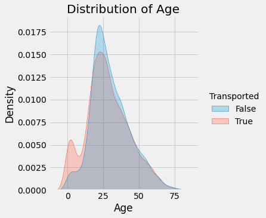
    


<em>Comment: Distribution of Age for those who were Transported or not. The only Age that seems to play a factor are those under ~15</em>


```python
# Proportion of those Transported under 15

df[df.Age < 15].Transported.value_counts() / df[df.Age < 15].shape[0]
```


    True     0.657143
    False    0.342857
    Name: Transported, dtype: float64


```python
# Proportion among the whole dataset

df.Transported.value_counts() / df.shape[0]
```


    True     0.503624
    False    0.496376
    Name: Transported, dtype: float64


```python
# Loop through Age values and look at proportions of Transported

true_prop_array = []

for age in range(1, 80):
    true_prop_array.append((df[df.Age < age].Transported.value_counts() / df[df.Age < age].shape[0])[True])
    
plt.plot(list(range(1, 80)), true_prop_array)
plt.title("Transported Proportion rates below Age value")
plt.xlabel("Age")
plt.ylim(0, 1)
plt.show()
```


    
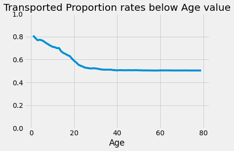
    


<em>Comment: Proportion of those Transported below a certain Age. For example, for those under 20, there were about 60% Transported.</em>


```python
np.max(df.Age)
```


    79.0


```python
age_prop = []


for age in range(1, 80):
    age_prop.append(np.round(df[df.Age <= age].shape[0] / df.shape[0], 4))
    

plt.plot(list(range(1, 80)), age_prop)
plt.title("Cumulative Distribution of Age")
plt.show()
```


    
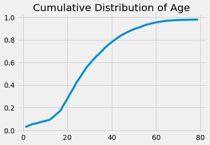
    


<em>Comment: Cumulative distribution of Age. Our age group with high rates of those Transported make up less than 10% of the data but should still be useful.</em>

### CryoSleep


```python
sns.catplot(x="CryoSleep", kind="count", hue='Transported', data=df)
plt.show()
```


    
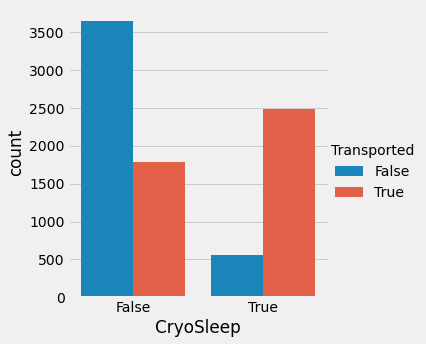
    


<em>Comment: CryoSleep does seem to be an important factor into those who were Transported or not.</em>


```python
pd.crosstab(df.Transported, df.CryoSleep)
```


<div>
<style scoped>
    .dataframe tbody tr th:only-of-type {
        vertical-align: middle;
    }

    .dataframe tbody tr th {
        vertical-align: top;
    }

    .dataframe thead th {
        text-align: right;
    }
</style>
<table border="1" class="dataframe">
  <thead>
    <tr style="text-align: right;">
      <th>CryoSleep</th>
      <th>False</th>
      <th>True</th>
    </tr>
    <tr>
      <th>Transported</th>
      <th></th>
      <th></th>
    </tr>
  </thead>
  <tbody>
    <tr>
      <th>False</th>
      <td>3650</td>
      <td>554</td>
    </tr>
    <tr>
      <th>True</th>
      <td>1789</td>
      <td>2483</td>
    </tr>
  </tbody>
</table>
</div>


### Cabin

For Cabin we are going to have to create new columns using the main cabin identifier (the first letter) and P or S for Port or Starboard


```python
cab_array = []

for cab in df.Cabin:
    if str(cab)[:1] == "n":
        cab_array.append("NA")
    else:
        cab_array.append(str(cab)[:1]) # extract first letter
        
df['Cab_id'] = cab_array
```


```python
ps_array = []

for cab in df.Cabin:
    if str(cab)[:1] == "n":
        ps_array.append("NA")
    else:
        ps_array.append(str(cab)[-1]) # extract first letter
        
df['PS_id'] = ps_array
```


```python
sns.catplot(x="Cab_id", kind="count", hue='Transported', data=df).set(title="Transported Count by Cabin")
plt.show()
```


    
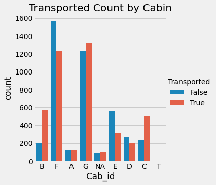
    


<em>Comment: High rates of being Transported occur in cabins B and C and the largest amount of passengers are from cabins F and G</em>


```python
sns.catplot(x="PS_id", kind="count", hue='Transported', data=df).set(title="Transported Count by P/S")
plt.show()
```


    
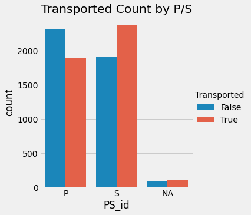
    


<em>Comment: There were more passengers Transported on the starboard side but the difference is minimal and doesn't seem to be that big of a factor.</em>

### HomePlanet


```python
sns.catplot(x="HomePlanet", kind="count", hue='Transported', data=df).set(title="Transported Count by HomePlanet")
plt.show()
```


    
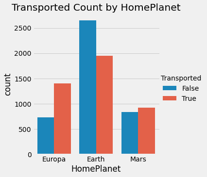
    


<em>Comment: Passengers from Europa have the highest rate of those Transported, followed by Mars then Earth. Earth has the most passengers but lowest Transported rate.</em>


```python
sns.catplot(x="Cab_id", 
            kind="count", 
            hue='HomePlanet', 
            data=df).set(title="Passenger Count by Cabin and HomePlanet")
plt.show()
```


    
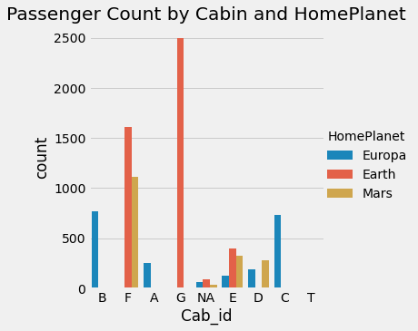
    


<em>Comment: Passengers from Europa were mainly in cabins B and C which also had the highest rate of those who were Transported. We don't have the layout of the ship so we are not sure which is the main contributing factor to being Transported between the two variables.</em>

- Question: How many from Europa opted for CryoSleep? We know CryoSleep had a high rate of being Transported.


```python
# No. of passengers fro Europa

pd.crosstab(df.HomePlanet, df.CryoSleep)
```


<div>
<style scoped>
    .dataframe tbody tr th:only-of-type {
        vertical-align: middle;
    }

    .dataframe tbody tr th {
        vertical-align: top;
    }

    .dataframe thead th {
        text-align: right;
    }
</style>
<table border="1" class="dataframe">
  <thead>
    <tr style="text-align: right;">
      <th>CryoSleep</th>
      <th>False</th>
      <th>True</th>
    </tr>
    <tr>
      <th>HomePlanet</th>
      <th></th>
      <th></th>
    </tr>
  </thead>
  <tbody>
    <tr>
      <th>Earth</th>
      <td>3106</td>
      <td>1382</td>
    </tr>
    <tr>
      <th>Europa</th>
      <td>1162</td>
      <td>911</td>
    </tr>
    <tr>
      <th>Mars</th>
      <td>1047</td>
      <td>669</td>
    </tr>
  </tbody>
</table>
</div>


```python
# Rate of CryoSleep from HomePlanets

home_array = ['Earth', 'Europa', 'Mars']

for home in home_array:
    print(str(home), 
          round(np.sum(df[df.HomePlanet == home]['CryoSleep'] == True)/df[df.HomePlanet == home].shape[0], 4))
```

    Earth 0.3003
    Europa 0.4275
    Mars 0.3803
    

<em>Comment: There was a higher rate of CryoSleep of those from Europa but not significantly higher than Mars where Mars we saw a rate of being Transported near 50% but it can still be a contributing factor/.</em>

### Destination


```python
fig, (ax1, ax2) = plt.subplots(1, 2, figsize=(15, 5), sharey=True)
sns.countplot(ax=ax1, y="Destination",  
            hue='Transported', 
            data=df).set(title="Passenger Destination Count")
sns.countplot(ax=ax2, y="Destination", 
            hue='HomePlanet', 
            data=df)
plt.show()
```


    
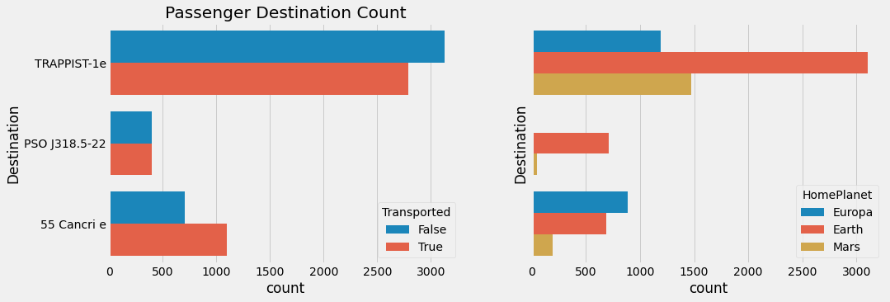
    


<em>Comment: Nothing really stands here in terms of passengers Transported. The highest rate were those traveling to '55 Cancri e' and a high proportion of those passengers were from Europa who have the highest rate of being Transported. </em>

### VIP


```python
sns.countplot(y="VIP",  
            hue='Transported', 
            data=df).set(title="Passenger VIP Count")
plt.show()
```


    
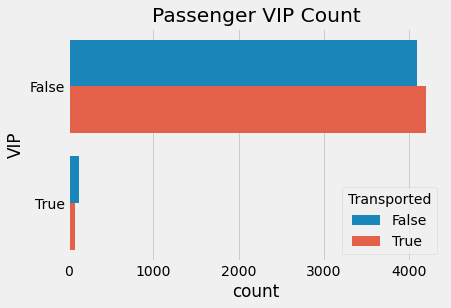
    


<em>Comment: VIP does not appear to be an important factor when considering a passenger who was Transported or not. The rates are similar and a very small amount of passengers opted for VIP.</em>

### Numeric Spending: RoomService, FoodCourt, ShoppingMall, Spa, VRDeck


```python
df.info()
```

    <class 'pandas.core.frame.DataFrame'>
    RangeIndex: 8693 entries, 0 to 8692
    Data columns (total 16 columns):
     #   Column        Non-Null Count  Dtype  
    ---  ------        --------------  -----  
     0   PassengerId   8693 non-null   object 
     1   HomePlanet    8492 non-null   object 
     2   CryoSleep     8476 non-null   object 
     3   Cabin         8494 non-null   object 
     4   Destination   8511 non-null   object 
     5   Age           8514 non-null   float64
     6   VIP           8490 non-null   object 
     7   RoomService   8512 non-null   float64
     8   FoodCourt     8510 non-null   float64
     9   ShoppingMall  8485 non-null   float64
     10  Spa           8510 non-null   float64
     11  VRDeck        8505 non-null   float64
     12  Name          8493 non-null   object 
     13  Transported   8693 non-null   bool   
     14  Cab_id        8693 non-null   object 
     15  PS_id         8693 non-null   object 
    dtypes: bool(1), float64(6), object(9)
    memory usage: 1.0+ MB
    


```python
df_num = df.iloc[:,[7, 8, 9, 10, 11, 13]]

sns.pairplot(df_num, hue='Transported')
plt.show()
```


    
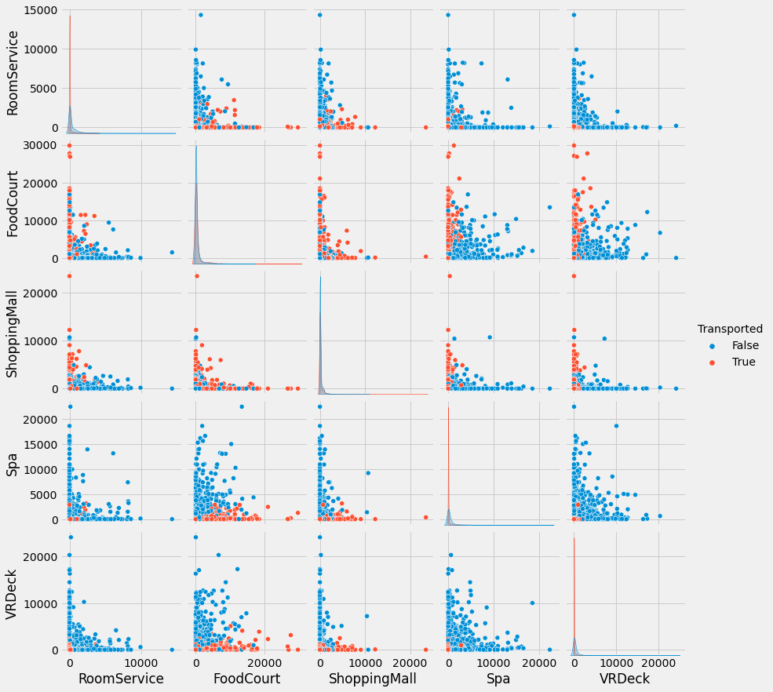
    


<em>Comment: It seems like there is some sort of correlation with FoodCourt and VRDeck and those who were Transported or not. Maybe this has to do with their location at the time of the anomoly. The data is also hiighly skewed so a log transformation should do. A lot of values are zero so we will add 1 to prevent errors.</em>


```python
sns.heatmap(df_num.iloc[:,:5].corr())
plt.show()
```


    
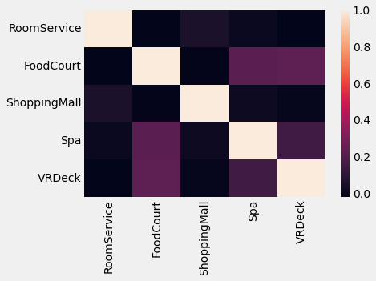
    


<em>Comment: Highest correlation between VRDeck/Foodcourt and Spa/FoodCourt.</em>


```python
# Add 1 to values and Log transformation

df_log = pd.concat((np.log(df_num.iloc[:,:5] + 1), df_num.iloc[:,5]), axis=1)
```


```python
fig, ax = plt.subplots(figsize=(12, 12))
sns.scatterplot(data=df_log, x='VRDeck', y='FoodCourt', hue='Transported')
plt.show()
```


    
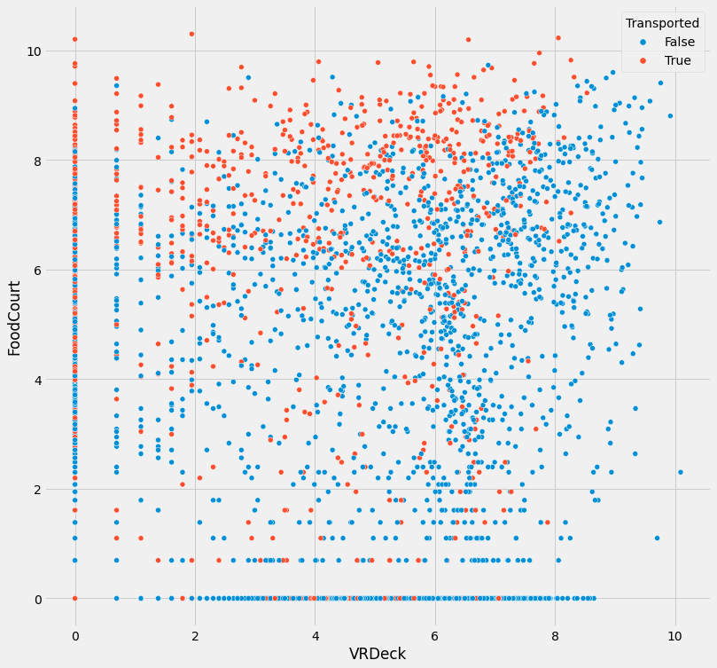
    


<em>Comment: Using the log transformation we can see the two groups do have some weak clustering which will still be useful for modeling.</em>

### PassengerID and Name

- PassengerId is not useful since each value is unique.
- Name is most likely not useful but we can still check how many unique values there are and see if there is anything we can use.


```python
name_array = []

for name in df.Name:
    if str(name) == 'nan':
        name_array.append("NA")
    else:
        name_array.append(name.split(' ')[1])
        
df['Last_name'] = name_array
```


```python
len(df.Last_name.unique())
```


    2218


<em>Comment: It looks like there are a lot of people traveling with someone, it's possible people were Transported or not depending on their family.</em>


```python
# Data Frame of Last Name and frequency

name_df = pd.DataFrame(df.Last_name.value_counts())

name_df.head()
```


<div>
<style scoped>
    .dataframe tbody tr th:only-of-type {
        vertical-align: middle;
    }

    .dataframe tbody tr th {
        vertical-align: top;
    }

    .dataframe thead th {
        text-align: right;
    }
</style>
<table border="1" class="dataframe">
  <thead>
    <tr style="text-align: right;">
      <th></th>
      <th>Last_name</th>
    </tr>
  </thead>
  <tbody>
    <tr>
      <th>NA</th>
      <td>200</td>
    </tr>
    <tr>
      <th>Casonston</th>
      <td>18</td>
    </tr>
    <tr>
      <th>Oneiles</th>
      <td>16</td>
    </tr>
    <tr>
      <th>Domington</th>
      <td>15</td>
    </tr>
    <tr>
      <th>Litthews</th>
      <td>15</td>
    </tr>
  </tbody>
</table>
</div>


```python
# Filter for groups large than 5, this could be useful information for our test data

large_groups = name_df[name_df['Last_name'] > 5]

large_groups = pd.DataFrame({'Last_name':large_groups.index, 'Count':np.array(large_groups.Last_name)})

large_groups.head()
```


<div>
<style scoped>
    .dataframe tbody tr th:only-of-type {
        vertical-align: middle;
    }

    .dataframe tbody tr th {
        vertical-align: top;
    }

    .dataframe thead th {
        text-align: right;
    }
</style>
<table border="1" class="dataframe">
  <thead>
    <tr style="text-align: right;">
      <th></th>
      <th>Last_name</th>
      <th>Count</th>
    </tr>
  </thead>
  <tbody>
    <tr>
      <th>0</th>
      <td>NA</td>
      <td>200</td>
    </tr>
    <tr>
      <th>1</th>
      <td>Casonston</td>
      <td>18</td>
    </tr>
    <tr>
      <th>2</th>
      <td>Oneiles</td>
      <td>16</td>
    </tr>
    <tr>
      <th>3</th>
      <td>Domington</td>
      <td>15</td>
    </tr>
    <tr>
      <th>4</th>
      <td>Litthews</td>
      <td>15</td>
    </tr>
  </tbody>
</table>
</div>


```python
# Create a Data Frame of the rate of those Transported by group name

name_trans_rate = {'Last_name':[],'Size':[], 'Transport_rate':[]}


for idx, name in enumerate(large_groups.Last_name):
    name_trans_rate['Last_name'].append(name)
    name_trans_rate['Size'].append(large_groups['Count'][idx])
    name_trans_rate['Transport_rate'].append(np.sum(df[df.Last_name == name].Transported == True) / df[df.Last_name == name].shape[0])

name_df = pd.DataFrame(name_trans_rate)
```


```python
# Sort the data by rate

name_df = name_df.sort_values('Transport_rate', ascending=False)

name_df.head()
```


<div>
<style scoped>
    .dataframe tbody tr th:only-of-type {
        vertical-align: middle;
    }

    .dataframe tbody tr th {
        vertical-align: top;
    }

    .dataframe thead th {
        text-align: right;
    }
</style>
<table border="1" class="dataframe">
  <thead>
    <tr style="text-align: right;">
      <th></th>
      <th>Last_name</th>
      <th>Size</th>
      <th>Transport_rate</th>
    </tr>
  </thead>
  <tbody>
    <tr>
      <th>326</th>
      <td>Ambleetive</td>
      <td>6</td>
      <td>1.0</td>
    </tr>
    <tr>
      <th>463</th>
      <td>Connon</td>
      <td>6</td>
      <td>1.0</td>
    </tr>
    <tr>
      <th>377</th>
      <td>Brakeng</td>
      <td>6</td>
      <td>1.0</td>
    </tr>
    <tr>
      <th>386</th>
      <td>Ametic</td>
      <td>6</td>
      <td>1.0</td>
    </tr>
    <tr>
      <th>396</th>
      <td>Prie</td>
      <td>6</td>
      <td>1.0</td>
    </tr>
  </tbody>
</table>
</div>


```python
sns.scatterplot(x='Size', y='Transport_rate', data=name_df[name_df.Last_name != "NA"])
plt.show()
```


    
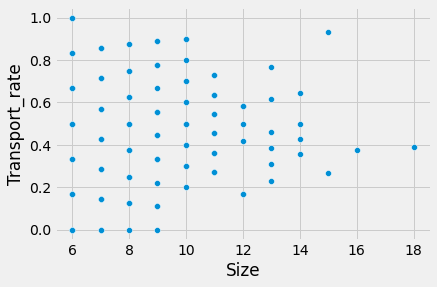
    


<em>Comment: I was hoping for some type of clustering between the lower and higher Transported Rates but there is nothing that really stands out here. Each group size seems to have a wide range and the larger groups start to squeeze to the average. We can create two variables, High Transport Rate [0, 1] and Low Transport Rate [0, 1], using the Last Name and the rate. Set the threshold to 80% and 20% and adjust as necessary when modeling.</em>


```python
# High rate names

name_high_rate = np.array(name_df[name_df.Transport_rate > 0.8].Last_name)
```


```python
# Create a new column

df['Name_high_rate'] = 0
```


```python
# Loop through and find high rate names

for idx, name in enumerate(df.Last_name):
    if name in name_high_rate:
        df.iloc[idx, 17] = 1
```


```python
df.Name_high_rate.sum()
```


    273


```python
# Low rate names

name_low_rate = np.array(name_df[name_df.Transport_rate < 0.2].Last_name)

# Create a new column

df['Name_low_rate'] = 0

# Loop through and find high rate names

for idx, name in enumerate(df.Last_name):
    if name in name_low_rate:
        df.iloc[idx, 18] = 1
```


```python
df.Name_low_rate.sum()
```


    299


## Prep Data for Modeling


```python
df.info()
```

    <class 'pandas.core.frame.DataFrame'>
    RangeIndex: 8693 entries, 0 to 8692
    Data columns (total 19 columns):
     #   Column          Non-Null Count  Dtype  
    ---  ------          --------------  -----  
     0   PassengerId     8693 non-null   object 
     1   HomePlanet      8492 non-null   object 
     2   CryoSleep       8476 non-null   object 
     3   Cabin           8494 non-null   object 
     4   Destination     8511 non-null   object 
     5   Age             8514 non-null   float64
     6   VIP             8490 non-null   object 
     7   RoomService     8512 non-null   float64
     8   FoodCourt       8510 non-null   float64
     9   ShoppingMall    8485 non-null   float64
     10  Spa             8510 non-null   float64
     11  VRDeck          8505 non-null   float64
     12  Name            8493 non-null   object 
     13  Transported     8693 non-null   bool   
     14  Cab_id          8693 non-null   object 
     15  PS_id           8693 non-null   object 
     16  Last_name       8693 non-null   object 
     17  Name_high_rate  8693 non-null   int64  
     18  Name_low_rate   8693 non-null   int64  
    dtypes: bool(1), float64(6), int64(2), object(10)
    memory usage: 1.2+ MB
    

- We can drop Cabin, VIP and Name
- Assign False to NA CryoSleep, convert to [0, 1]
- Add 1 to all Spending Columns
- Assign the Median age to Age NA's
- Create NA category for unknown HomePlanet and Destination


```python
# Assign NA category to nan values

df['HomePlanet'] = df.HomePlanet.fillna("NA")
df['Destination'] = df.Destination.fillna("NA")
df['CryoSleep'] = df.CryoSleep.fillna(False)
```


```python
# Convert CryoSleep to Int

df['CryoSleep'] = df.CryoSleep.replace({True:1, False:0})
```


```python
# Assign mean Age to nan values

df['Age'] = df.Age.fillna(df.Age.mean())
```


```python
# Add 1 to Spending Data

df.iloc[:,[7, 8, 9, 10, 11]] = df.iloc[:,[7, 8, 9, 10, 11]] + 1
```


```python
# Assign 1 to nan values in spending

spend_cols = ['RoomService', 'FoodCourt', 'ShoppingMall', 'Spa', 'VRDeck']

for sc in spend_cols:
    df[sc] = df[sc].fillna(1.0)
```


```python
df.RoomService.isna().sum()
```


    0


```python
df.info()
```

    <class 'pandas.core.frame.DataFrame'>
    RangeIndex: 8693 entries, 0 to 8692
    Data columns (total 19 columns):
     #   Column          Non-Null Count  Dtype  
    ---  ------          --------------  -----  
     0   PassengerId     8693 non-null   object 
     1   HomePlanet      8693 non-null   object 
     2   CryoSleep       8693 non-null   int64  
     3   Cabin           8494 non-null   object 
     4   Destination     8693 non-null   object 
     5   Age             8693 non-null   float64
     6   VIP             8490 non-null   object 
     7   RoomService     8693 non-null   float64
     8   FoodCourt       8693 non-null   float64
     9   ShoppingMall    8693 non-null   float64
     10  Spa             8693 non-null   float64
     11  VRDeck          8693 non-null   float64
     12  Name            8493 non-null   object 
     13  Transported     8693 non-null   bool   
     14  Cab_id          8693 non-null   object 
     15  PS_id           8693 non-null   object 
     16  Last_name       8693 non-null   object 
     17  Name_high_rate  8693 non-null   int64  
     18  Name_low_rate   8693 non-null   int64  
    dtypes: bool(1), float64(6), int64(3), object(9)
    memory usage: 1.2+ MB
    


```python
X = df.drop(['PassengerId', 'Cabin', 'VIP', 'Name'], axis=1)
y = df.Transported
```


```python
X_num_log = np.log(X.iloc[:,[4, 5, 6, 7, 8]]) # Log Spending categories

X_num = pd.concat((X.iloc[:,3], X_num_log), axis=1)

X_cat = X.iloc[:,[0, 2, 10, 11]] #home, cryo, dest, cab, ps

X_dum = pd.get_dummies(X_cat)

X_bi = X.iloc[:,[1, 13, 14]]
```


```python
# Scale the numeric variables

from sklearn.preprocessing import StandardScaler

scaler = StandardScaler()
X_scaled = scaler.fit_transform(X_num)
X_scaled = pd.DataFrame(X_scaled)
```


```python
# Create main training Data Frame

X_main = pd.concat((X_scaled, X_dum, X_bi), axis=1)
```

## Model 1: Logistic Regression

For the first model we will try a Logistic Regression. We will try some hyperparamter optimization and verify the model validity use 5-fold cross validation


```python
# Model Packages

from sklearn.model_selection import GridSearchCV
from sklearn.linear_model import LogisticRegression
```


```python
clf = LogisticRegression(random_state=0, max_iter=1000, penalty='l2')

param_grid = {'solver':['newton-cg', 'lbfgs', 'saga'], 'C':[1, 10, 100]}

cv = GridSearchCV(clf, param_grid, cv=5)

cv.fit(X_main, y)
```

    C:\Users\tpreston\Anaconda3\lib\site-packages\sklearn\linear_model\_sag.py:328: ConvergenceWarning: The max_iter was reached which means the coef_ did not converge
      warnings.warn("The max_iter was reached which means "
    


    GridSearchCV(cv=5, estimator=LogisticRegression(max_iter=1000, random_state=0),
                 param_grid={'C': [1, 10, 100],
                             'solver': ['newton-cg', 'lbfgs', 'saga']})


```python
cv.best_score_
```


    0.7847696948962772


```python
cv.best_params_
```


    {'C': 1, 'solver': 'newton-cg'}


## Model 2: Random Forest


```python
from sklearn.ensemble import RandomForestClassifier

clf = RandomForestClassifier(random_state=0)

param_grid = {'n_estimators':[100, 200], 'max_depth':np.arange(10, 20)}

cv = GridSearchCV(clf, param_grid, cv=5)

cv.fit(X_main, y)
```


    GridSearchCV(cv=5, estimator=RandomForestClassifier(random_state=0),
                 param_grid={'max_depth': array([10, 11, 12, 13, 14, 15, 16, 17, 18, 19]),
                             'n_estimators': [100, 200]})


```python
cv.best_score_
```


    0.8086998929983039


```python
cv.best_params_
```


    {'max_depth': 12, 'n_estimators': 200}


## Model 3: Gradient Boost


```python
from sklearn.ensemble import GradientBoostingClassifier

clf = GradientBoostingClassifier(random_state=0)

param_grid = {'n_estimators':[100, 200], 'max_depth':np.arange(1, 5)}

cv = GridSearchCV(clf, param_grid, cv=5)

cv.fit(X_main, y)
```


    GridSearchCV(cv=5, estimator=GradientBoostingClassifier(random_state=0),
                 param_grid={'max_depth': array([1, 2, 3, 4]),
                             'n_estimators': [100, 200]})


```python
cv.best_score_
```


    0.8089285867901543


```python
cv.best_params_
```


    {'max_depth': 4, 'n_estimators': 100}


## Prepare Test Data


```python
test_df = pd.read_csv('test.csv')
```


```python
test_df.head()
```


<div>
<style scoped>
    .dataframe tbody tr th:only-of-type {
        vertical-align: middle;
    }

    .dataframe tbody tr th {
        vertical-align: top;
    }

    .dataframe thead th {
        text-align: right;
    }
</style>
<table border="1" class="dataframe">
  <thead>
    <tr style="text-align: right;">
      <th></th>
      <th>PassengerId</th>
      <th>HomePlanet</th>
      <th>CryoSleep</th>
      <th>Cabin</th>
      <th>Destination</th>
      <th>Age</th>
      <th>VIP</th>
      <th>RoomService</th>
      <th>FoodCourt</th>
      <th>ShoppingMall</th>
      <th>Spa</th>
      <th>VRDeck</th>
      <th>Name</th>
    </tr>
  </thead>
  <tbody>
    <tr>
      <th>0</th>
      <td>0013_01</td>
      <td>Earth</td>
      <td>True</td>
      <td>G/3/S</td>
      <td>TRAPPIST-1e</td>
      <td>27.0</td>
      <td>False</td>
      <td>0.0</td>
      <td>0.0</td>
      <td>0.0</td>
      <td>0.0</td>
      <td>0.0</td>
      <td>Nelly Carsoning</td>
    </tr>
    <tr>
      <th>1</th>
      <td>0018_01</td>
      <td>Earth</td>
      <td>False</td>
      <td>F/4/S</td>
      <td>TRAPPIST-1e</td>
      <td>19.0</td>
      <td>False</td>
      <td>0.0</td>
      <td>9.0</td>
      <td>0.0</td>
      <td>2823.0</td>
      <td>0.0</td>
      <td>Lerome Peckers</td>
    </tr>
    <tr>
      <th>2</th>
      <td>0019_01</td>
      <td>Europa</td>
      <td>True</td>
      <td>C/0/S</td>
      <td>55 Cancri e</td>
      <td>31.0</td>
      <td>False</td>
      <td>0.0</td>
      <td>0.0</td>
      <td>0.0</td>
      <td>0.0</td>
      <td>0.0</td>
      <td>Sabih Unhearfus</td>
    </tr>
    <tr>
      <th>3</th>
      <td>0021_01</td>
      <td>Europa</td>
      <td>False</td>
      <td>C/1/S</td>
      <td>TRAPPIST-1e</td>
      <td>38.0</td>
      <td>False</td>
      <td>0.0</td>
      <td>6652.0</td>
      <td>0.0</td>
      <td>181.0</td>
      <td>585.0</td>
      <td>Meratz Caltilter</td>
    </tr>
    <tr>
      <th>4</th>
      <td>0023_01</td>
      <td>Earth</td>
      <td>False</td>
      <td>F/5/S</td>
      <td>TRAPPIST-1e</td>
      <td>20.0</td>
      <td>False</td>
      <td>10.0</td>
      <td>0.0</td>
      <td>635.0</td>
      <td>0.0</td>
      <td>0.0</td>
      <td>Brence Harperez</td>
    </tr>
  </tbody>
</table>
</div>


- Create Cabin columns
- Mean age from train
- append + 1 to all spending
- append NA to nan for HomePlanet, Destination
- filter names from training for high or low rates
- Drop VIP, Name, PassengerId


```python
test_df.info()
```

    <class 'pandas.core.frame.DataFrame'>
    RangeIndex: 4277 entries, 0 to 4276
    Data columns (total 13 columns):
     #   Column        Non-Null Count  Dtype  
    ---  ------        --------------  -----  
     0   PassengerId   4277 non-null   object 
     1   HomePlanet    4190 non-null   object 
     2   CryoSleep     4184 non-null   object 
     3   Cabin         4177 non-null   object 
     4   Destination   4185 non-null   object 
     5   Age           4186 non-null   float64
     6   VIP           4184 non-null   object 
     7   RoomService   4195 non-null   float64
     8   FoodCourt     4171 non-null   float64
     9   ShoppingMall  4179 non-null   float64
     10  Spa           4176 non-null   float64
     11  VRDeck        4197 non-null   float64
     12  Name          4183 non-null   object 
    dtypes: float64(6), object(7)
    memory usage: 434.5+ KB
    


```python
cab_array = []

for cab in test_df.Cabin:
    if str(cab)[:1] == "n":
        cab_array.append("NA")
    else:
        cab_array.append(str(cab)[:1]) # extract first letter
        
test_df['Cab_id'] = cab_array

ps_array = []

for cab in test_df.Cabin:
    if str(cab)[:1] == "n":
        ps_array.append("NA")
    else:
        ps_array.append(str(cab)[-1]) # extract last letter
        
test_df['PS_id'] = ps_array
```


```python
test_df['Age'] = test_df.Age.fillna(df.Age.mean())


# for idx, age in enumerate(test_df.Age):
#     if np.isnan(age):
#         test_df.iloc[idx,5] = np.mean(df.Age)
```


```python
test_df.iloc[:,[7, 8, 9, 10, 11]] = test_df.iloc[:,[7, 8, 9, 10, 11]] + 1
```


```python
test_df['RoomService'] = test_df.RoomService.fillna(1.0)
test_df['FoodCourt'] = test_df.FoodCourt.fillna(1.0)
test_df['ShoppingMall'] = test_df.ShoppingMall.fillna(1.0)
test_df['Spa'] = test_df.Spa.fillna(1.0)
test_df['VRDeck'] = test_df.VRDeck.fillna(1.0)

# for idx, room in enumerate(test_df.RoomService):
#     if np.isnan(room):
#         test_df.iloc[idx, 7] = 1.0

# for idx, food in enumerate(test_df.FoodCourt):
#     if np.isnan(food):
#         test_df.iloc[idx, 8] = 1.0
        
# for idx, shop in enumerate(test_df.ShoppingMall):
#     if np.isnan(shop):
#         test_df.iloc[idx, 9] = 1.0
        
# for idx, spa in enumerate(test_df.Spa):
#     if np.isnan(spa):
#         test_df.iloc[idx, 10] = 1.0

# for idx, vr in enumerate(test_df.VRDeck):
#     if np.isnan(vr):
#         test_df.iloc[idx, 11] = 1.0
```


```python
test_df['HomePlanet'] = test_df.HomePlanet.fillna("NA")
test_df['Destination'] = test_df.Destination.fillna("NA")
test_df['CryoSleep'] = test_df.CryoSleep.fillna(False)

# for idx, home in enumerate(test_df.HomePlanet):
#     if str(home) == "nan":
#         test_df.iloc[idx, 1] = "NA"
        
# for idx, dest in enumerate(test_df.Destination):
#     if str(dest) == "nan":
#         test_df.iloc[idx, 4] = "NA"
        
# for idx, cryo in enumerate(test_df.CryoSleep):
#     if str(cryo) == "nan":
#         test_df.iloc[idx, 2] = False
```


```python
test_df['CryoSleep'] = test_df.CryoSleep.replace({True:1, False:0})


# test_df['CryoSleep'] = test_df.CryoSleep * 1
```


```python
name_array = []

for name in test_df.Name:
    if str(name) == 'nan':
        name_array.append("NA")
    else:
        name_array.append(name.split(' ')[1])
        
test_df['Last_name'] = name_array
```


```python
test_df['Name_high_rate'] = 0
test_df['Name_low_rate'] = 0
```


```python
test_df.info()
```

    <class 'pandas.core.frame.DataFrame'>
    RangeIndex: 4277 entries, 0 to 4276
    Data columns (total 18 columns):
     #   Column          Non-Null Count  Dtype  
    ---  ------          --------------  -----  
     0   PassengerId     4277 non-null   object 
     1   HomePlanet      4277 non-null   object 
     2   CryoSleep       4277 non-null   int64  
     3   Cabin           4177 non-null   object 
     4   Destination     4277 non-null   object 
     5   Age             4277 non-null   float64
     6   VIP             4184 non-null   object 
     7   RoomService     4277 non-null   float64
     8   FoodCourt       4277 non-null   float64
     9   ShoppingMall    4277 non-null   float64
     10  Spa             4277 non-null   float64
     11  VRDeck          4277 non-null   float64
     12  Name            4183 non-null   object 
     13  Cab_id          4277 non-null   object 
     14  PS_id           4277 non-null   object 
     15  Last_name       4277 non-null   object 
     16  Name_high_rate  4277 non-null   int64  
     17  Name_low_rate   4277 non-null   int64  
    dtypes: float64(6), int64(3), object(9)
    memory usage: 601.6+ KB
    


```python
# Loop through and find high rate names

for idx, name in enumerate(test_df.Last_name):
    if name in name_high_rate:
        test_df.iloc[idx, 16] = 1
```


```python
# Loop through and find low rate names

for idx, name in enumerate(test_df.Last_name):
    if name in name_low_rate:
        test_df.iloc[idx, 17] = 1
```


```python
test_df.info()
```

    <class 'pandas.core.frame.DataFrame'>
    RangeIndex: 4277 entries, 0 to 4276
    Data columns (total 18 columns):
     #   Column          Non-Null Count  Dtype  
    ---  ------          --------------  -----  
     0   PassengerId     4277 non-null   object 
     1   HomePlanet      4277 non-null   object 
     2   CryoSleep       4277 non-null   int64  
     3   Cabin           4177 non-null   object 
     4   Destination     4277 non-null   object 
     5   Age             4277 non-null   float64
     6   VIP             4184 non-null   object 
     7   RoomService     4277 non-null   float64
     8   FoodCourt       4277 non-null   float64
     9   ShoppingMall    4277 non-null   float64
     10  Spa             4277 non-null   float64
     11  VRDeck          4277 non-null   float64
     12  Name            4183 non-null   object 
     13  Cab_id          4277 non-null   object 
     14  PS_id           4277 non-null   object 
     15  Last_name       4277 non-null   object 
     16  Name_high_rate  4277 non-null   int64  
     17  Name_low_rate   4277 non-null   int64  
    dtypes: float64(6), int64(3), object(9)
    memory usage: 601.6+ KB
    


```python
# X_cat = home, cryo, dest, cab, ps

test_X_cat = test_df.iloc[:,[1, 4, 13, 14]]

test_X_num = np.log(test_df.iloc[:,[7, 8, 9, 10, 11]])

test_X_num = pd.concat((test_df.iloc[:,5], test_X_num), axis=1)

test_X_bi = test_df.iloc[:,[2, 16, 17]]

test_X_dum = pd.get_dummies(test_X_cat)

# Scale the numeric variables

t_scaler = StandardScaler()

test_X_scaled = t_scaler.fit_transform(test_X_num)

test_X_scaled = pd.DataFrame(test_X_scaled)

test_X_main = pd.concat((test_X_scaled, test_X_dum, test_X_bi), axis=1)
```


```python
test_X_main.head() # Test Data
```


<div>
<style scoped>
    .dataframe tbody tr th:only-of-type {
        vertical-align: middle;
    }

    .dataframe tbody tr th {
        vertical-align: top;
    }

    .dataframe thead th {
        text-align: right;
    }
</style>
<table border="1" class="dataframe">
  <thead>
    <tr style="text-align: right;">
      <th></th>
      <th>0</th>
      <th>1</th>
      <th>2</th>
      <th>3</th>
      <th>4</th>
      <th>5</th>
      <th>HomePlanet_Earth</th>
      <th>HomePlanet_Europa</th>
      <th>HomePlanet_Mars</th>
      <th>HomePlanet_NA</th>
      <th>...</th>
      <th>Cab_id_F</th>
      <th>Cab_id_G</th>
      <th>Cab_id_NA</th>
      <th>Cab_id_T</th>
      <th>PS_id_NA</th>
      <th>PS_id_P</th>
      <th>PS_id_S</th>
      <th>CryoSleep</th>
      <th>Name_high_rate</th>
      <th>Name_low_rate</th>
    </tr>
  </thead>
  <tbody>
    <tr>
      <th>0</th>
      <td>-0.118479</td>
      <td>-0.644830</td>
      <td>-0.646513</td>
      <td>-0.628742</td>
      <td>-0.661615</td>
      <td>-0.624214</td>
      <td>1</td>
      <td>0</td>
      <td>0</td>
      <td>0</td>
      <td>...</td>
      <td>0</td>
      <td>1</td>
      <td>0</td>
      <td>0</td>
      <td>0</td>
      <td>0</td>
      <td>1</td>
      <td>1</td>
      <td>0</td>
      <td>0</td>
    </tr>
    <tr>
      <th>1</th>
      <td>-0.688858</td>
      <td>-0.644830</td>
      <td>0.140685</td>
      <td>-0.628742</td>
      <td>2.226792</td>
      <td>-0.624214</td>
      <td>1</td>
      <td>0</td>
      <td>0</td>
      <td>0</td>
      <td>...</td>
      <td>1</td>
      <td>0</td>
      <td>0</td>
      <td>0</td>
      <td>0</td>
      <td>0</td>
      <td>1</td>
      <td>0</td>
      <td>0</td>
      <td>0</td>
    </tr>
    <tr>
      <th>2</th>
      <td>0.166710</td>
      <td>-0.644830</td>
      <td>-0.646513</td>
      <td>-0.628742</td>
      <td>-0.661615</td>
      <td>-0.624214</td>
      <td>0</td>
      <td>1</td>
      <td>0</td>
      <td>0</td>
      <td>...</td>
      <td>0</td>
      <td>0</td>
      <td>0</td>
      <td>0</td>
      <td>0</td>
      <td>0</td>
      <td>1</td>
      <td>1</td>
      <td>0</td>
      <td>0</td>
    </tr>
    <tr>
      <th>3</th>
      <td>0.665792</td>
      <td>-0.644830</td>
      <td>2.362959</td>
      <td>-0.628742</td>
      <td>1.230087</td>
      <td>1.717606</td>
      <td>0</td>
      <td>1</td>
      <td>0</td>
      <td>0</td>
      <td>...</td>
      <td>0</td>
      <td>0</td>
      <td>0</td>
      <td>0</td>
      <td>0</td>
      <td>0</td>
      <td>1</td>
      <td>0</td>
      <td>0</td>
      <td>0</td>
    </tr>
    <tr>
      <th>4</th>
      <td>-0.617561</td>
      <td>0.234336</td>
      <td>-0.646513</td>
      <td>1.868292</td>
      <td>-0.661615</td>
      <td>-0.624214</td>
      <td>1</td>
      <td>0</td>
      <td>0</td>
      <td>0</td>
      <td>...</td>
      <td>1</td>
      <td>0</td>
      <td>0</td>
      <td>0</td>
      <td>0</td>
      <td>0</td>
      <td>1</td>
      <td>0</td>
      <td>0</td>
      <td>0</td>
    </tr>
  </tbody>
</table>
<p>5 rows × 29 columns</p>
</div>


```python
X_main.head() # Training Data
```


<div>
<style scoped>
    .dataframe tbody tr th:only-of-type {
        vertical-align: middle;
    }

    .dataframe tbody tr th {
        vertical-align: top;
    }

    .dataframe thead th {
        text-align: right;
    }
</style>
<table border="1" class="dataframe">
  <thead>
    <tr style="text-align: right;">
      <th></th>
      <th>0</th>
      <th>1</th>
      <th>2</th>
      <th>3</th>
      <th>4</th>
      <th>5</th>
      <th>HomePlanet_Earth</th>
      <th>HomePlanet_Europa</th>
      <th>HomePlanet_Mars</th>
      <th>HomePlanet_NA</th>
      <th>...</th>
      <th>Cab_id_F</th>
      <th>Cab_id_G</th>
      <th>Cab_id_NA</th>
      <th>Cab_id_T</th>
      <th>PS_id_NA</th>
      <th>PS_id_P</th>
      <th>PS_id_S</th>
      <th>CryoSleep</th>
      <th>Name_high_rate</th>
      <th>Name_low_rate</th>
    </tr>
  </thead>
  <tbody>
    <tr>
      <th>0</th>
      <td>0.709437</td>
      <td>-0.638181</td>
      <td>-0.650080</td>
      <td>-0.622995</td>
      <td>-0.664035</td>
      <td>-0.640034</td>
      <td>0</td>
      <td>1</td>
      <td>0</td>
      <td>0</td>
      <td>...</td>
      <td>0</td>
      <td>0</td>
      <td>0</td>
      <td>0</td>
      <td>0</td>
      <td>1</td>
      <td>0</td>
      <td>0</td>
      <td>0</td>
      <td>0</td>
    </tr>
    <tr>
      <th>1</th>
      <td>-0.336717</td>
      <td>1.090491</td>
      <td>0.135040</td>
      <td>0.646081</td>
      <td>1.614565</td>
      <td>0.745894</td>
      <td>1</td>
      <td>0</td>
      <td>0</td>
      <td>0</td>
      <td>...</td>
      <td>1</td>
      <td>0</td>
      <td>0</td>
      <td>0</td>
      <td>0</td>
      <td>0</td>
      <td>1</td>
      <td>0</td>
      <td>0</td>
      <td>0</td>
    </tr>
    <tr>
      <th>2</th>
      <td>2.034566</td>
      <td>0.753511</td>
      <td>2.139858</td>
      <td>-0.622995</td>
      <td>2.518191</td>
      <td>0.784254</td>
      <td>0</td>
      <td>1</td>
      <td>0</td>
      <td>0</td>
      <td>...</td>
      <td>0</td>
      <td>0</td>
      <td>0</td>
      <td>0</td>
      <td>0</td>
      <td>0</td>
      <td>1</td>
      <td>0</td>
      <td>0</td>
      <td>0</td>
    </tr>
    <tr>
      <th>3</th>
      <td>0.290975</td>
      <td>-0.638181</td>
      <td>1.790516</td>
      <td>1.682500</td>
      <td>2.264863</td>
      <td>1.277886</td>
      <td>0</td>
      <td>1</td>
      <td>0</td>
      <td>0</td>
      <td>...</td>
      <td>0</td>
      <td>0</td>
      <td>0</td>
      <td>0</td>
      <td>0</td>
      <td>0</td>
      <td>1</td>
      <td>0</td>
      <td>0</td>
      <td>0</td>
    </tr>
    <tr>
      <th>4</th>
      <td>-0.894666</td>
      <td>1.464342</td>
      <td>0.803380</td>
      <td>1.333879</td>
      <td>1.624920</td>
      <td>-0.240051</td>
      <td>1</td>
      <td>0</td>
      <td>0</td>
      <td>0</td>
      <td>...</td>
      <td>1</td>
      <td>0</td>
      <td>0</td>
      <td>0</td>
      <td>0</td>
      <td>0</td>
      <td>1</td>
      <td>0</td>
      <td>0</td>
      <td>0</td>
    </tr>
  </tbody>
</table>
<p>5 rows × 29 columns</p>
</div>


## Predict on Test Data


```python
t_pred = cv.predict(test_X_main)
```


```python
pred_df = pd.DataFrame({'PassengerId':test_df.PassengerId, 'Transported':t_pred})

pred_df.head()
```


<div>
<style scoped>
    .dataframe tbody tr th:only-of-type {
        vertical-align: middle;
    }

    .dataframe tbody tr th {
        vertical-align: top;
    }

    .dataframe thead th {
        text-align: right;
    }
</style>
<table border="1" class="dataframe">
  <thead>
    <tr style="text-align: right;">
      <th></th>
      <th>PassengerId</th>
      <th>Transported</th>
    </tr>
  </thead>
  <tbody>
    <tr>
      <th>0</th>
      <td>0013_01</td>
      <td>True</td>
    </tr>
    <tr>
      <th>1</th>
      <td>0018_01</td>
      <td>False</td>
    </tr>
    <tr>
      <th>2</th>
      <td>0019_01</td>
      <td>True</td>
    </tr>
    <tr>
      <th>3</th>
      <td>0021_01</td>
      <td>True</td>
    </tr>
    <tr>
      <th>4</th>
      <td>0023_01</td>
      <td>True</td>
    </tr>
  </tbody>
</table>
</div>


## Kaggle Result

The GradientBoost model resulted in a score of 80.24% on Kaggle which was similar to our CV score of 80.9%. There are some things we can do to try and improve this model like imputing the NA's for Cabin identifiers and changing to missing Spending Data to the median. I used 0 because it occured at a very high rate. We can also try and create groups for different ages and see if that helps.  
